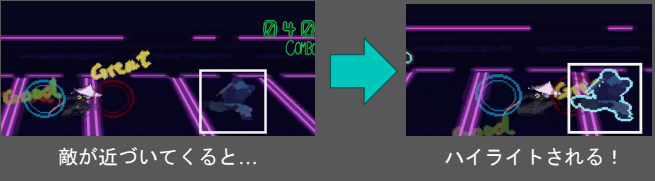
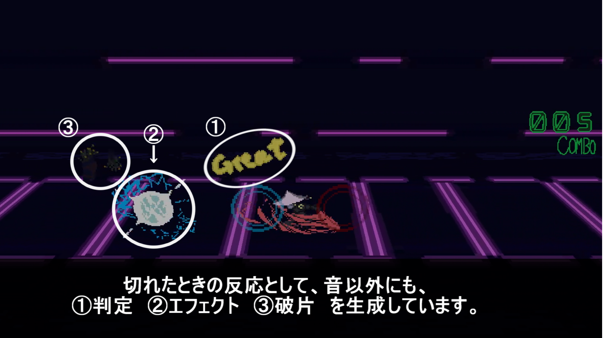
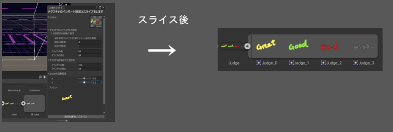

# Beat Samurai
## 作品情報
- コンセプト：リズムにノッて敵をズバズバ斬り倒していくリズムゲーム
- 制作期間：1ヶ月（2024年9月）
- チーム構成：1人（個人制作）
- 開発環境：Unity(2021.3.25f1)(C#)/Visual Studio 2022
- 担当箇所：
    - システム、スプライト分割ツール
    - スプライト
    - インゲームのBGM
- **使用アセット**：**[MIDI Animation Track]**(https://github.com/keijiro/MidiAnimationTrack)
MIDIデータからイベントを発火させる処理に本アセットを使用しています。  
MIDI解析部分については自作を試みましたが、一部のメタデータ（テンポ・トラック長など）が正常に取得できない状況が発生しました。  
制作期間と安定性を優先し、本アセットを採用しました。  
この経験から、今後はMIDI仕様の内部構造理解や独自パーサの実装にも挑戦していきたいと考えています。

## 工夫点
- どの敵を狙う必要があるのか分かりやすいように、プレイヤーにある程度近づいた敵をハイライト表示して、ひと目で見分けがつくようにしました。  

    
- 敵を倒すことを楽しんでほしいので、敵を倒したときの演出をプレイの邪魔にならない程度に増やしました。  

- スプライトを分割してアニメーションを作りやすいように、プレビュー付きのスプライト分割ツールを作成しました。  

## 動画ファイル・実行フォルダへのリンク
- [動画ファイルはこちら](https://github.com/Ton-1211/Game-Portfolio/blob/main/BeatSamurai/BeatSamurai%E3%83%97%E3%83%AC%E3%82%A4%E5%8B%95%E7%94%BB.mp4)
※GitHub上では動画を再生できません。「View raw」を押してダウンロードして視聴をお願いします。

- [実行フォルダはこちら](https://github.com/Ton-1211/Game-Portfolio/tree/main/BeatSamurai/BuildFile(BeatSamurai))

## 主なソースコードの概要とリンク
|スクリプト名（リンク）|概要|
|:---|:---|
|[PlayerScript.cs](https://github.com/Ton-1211/Game-Portfolio/blob/main/BeatSamurai/ProjectFile/BeatSamurai/Assets/Scripts/PlayerBehaviorScript.cs)|プレイヤーの動作（攻撃等）を行います。|
|[EnemyBehaviorScript.cs](https://github.com/Ton-1211/Game-Portfolio/blob/main/BeatSamurai/ProjectFile/BeatSamurai/Assets/Scripts/Enemy/EnemyBehaviorScript.cs)|敵の動作やハイライト、破片生成のメソッドを持つ基底クラスです。|
|[ConnectEnemyBehaviorScript.cs](https://github.com/Ton-1211/Game-Portfolio/blob/main/BeatSamurai/ProjectFile/BeatSamurai/Assets/Scripts/Enemy/ConnectEnemyBehaviorScript.cs)|EnemyBehavoirScriptの派生クラス、連動している敵（バイクと照準のようなセットの敵）の動作を行います。|
|[PieceScript.cs](https://github.com/Ton-1211/Game-Portfolio/blob/main/BeatSamurai/ProjectFile/BeatSamurai/Assets/Scripts/PieceScript.cs)|判定の精度に応じて破片を飛ばします。|
|[SpriteSlicerTest.cs](https://github.com/Ton-1211/Game-Portfolio/blob/main/BeatSamurai/ProjectFile/BeatSamurai/Assets/Scripts/Editor/SpriteSlicerTest.cs)|スプライトの分割設定やピボット設定をして分割するツールです。|