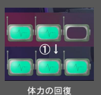
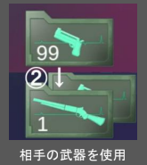
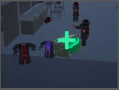

# Hack Gunner
## 作品情報
- コンセプト：倒した敵に乗り移って殲滅していくFPS
- 制作期間：10ヶ月（2024年4月～2025年1月）
- チーム構成：プランナー2人、プログラマー4人（本人含む）、デザイナー2人
- 開発環境：Unity(2021.3.25f1)/Visual Studio 2022
- 担当箇所（チーム内での役割）：
    - **全体的な役割**：仕様とコンセプトの食い違いの整理、チーム間の意見調整、資料共有による制作支援
    - **プログラム面**：タスク割り振り・理由の整理、仕様の言語化による齟齬の防止
- 担当箇所（主なゲーム内機能）：
    - キャラクターのステータス切り替え、被弾・撃破処理
    - 弾丸の動作（進行、衝突判定、衝突処理）
    - キャラクター、銃、弾丸のデータクラス
    - UI表示（武器アイコン、敵残数、画面エフェクト）

## 工夫点
- 銃の種類変更や編集の手間を減らすため、ScriptableObjectを用いたクラスで銃の種類に応じたデータを持ち、データの変更・編集箇所を分かりやすくしました。  

- 乗り移りでできることやテンポ感を、動きを見ながら話し合い調整して乗り移ることを楽しんでもらえるように心がけました。  

- 演出を調整して、自分が乗り移っているということをわかりやすくしました。

## 動画ファイル・実行フォルダへのリンク
- [動画ファイルはこちら](https://github.com/Ton-1211/Game-Portfolio/blob/main/HackGunner/HackGunner%E3%83%97%E3%83%AC%E3%82%A4%E5%8B%95%E7%94%BB.mp4)
※GitHub上では動画を再生できません。「View raw」を押してダウンロードして視聴をお願いします。

- [実行フォルダはこちら](https://github.com/Ton-1211/Game-Portfolio/tree/main/HackGunner/BuildFile(HackGunner))

## 主なソースコードの概要とリンク
|スクリプト名（リンク）|概要|
|:---|:---|
|[BaseData.cs](https://github.com/Ton-1211/Game-Portfolio/blob/main/HackGunner/ProjectFile/HackGunner/Assets/Suzuki/Scripts/DataBase/Base/BaseData.cs)|データクラスの基底クラスです。|
|[WeaponData.cs](https://github.com/Ton-1211/Game-Portfolio/blob/main/HackGunner/ProjectFile/HackGunner/Assets/Suzuki/Scripts/DataBase/Weapon/WeaponData.cs)|BaseDataの派生クラス、武器や発射する弾丸のデータクラスです。|
|[GunStatus.cs](https://github.com/Ton-1211/Game-Portfolio/blob/main/HackGunner/ProjectFile/HackGunner/Assets/Suzuki/Scripts/GunStatus.cs)|銃の種類管理、発砲を行います。|
|[PlayerRay.cs](https://github.com/Ton-1211/Game-Portfolio/blob/main/HackGunner/ProjectFile/HackGunner/Assets/Ebihara/Scripts/PlayerRay.cs)|視点による乗り移り、射撃の処理と、乗り移りの視点範囲拡大と射撃処理を担当しました。|
|[GunUIScript.cs](https://github.com/Ton-1211/Game-Portfolio/blob/main/HackGunner/ProjectFile/HackGunner/Assets/Suzuki/Scripts/UI/GunUIScript.cs)|武器のUI表示です。|